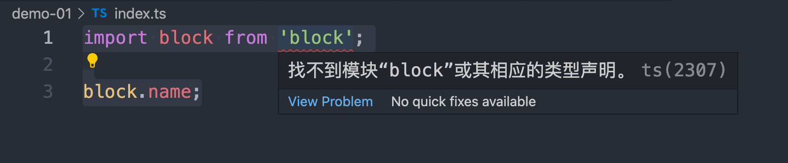

# Typescript 申明文件浅析

> 以 typescript 版本 v4.6.2 为例

## 场景一：d.ts 申明文件不生效

参考 `demo-01`，index.ts 中导入一个全局模块 `block`，这时候编写一个 `index.d.ts` 文件申明这个文件：

```ts
// index.ts
import block from 'block';

block.name;

// index.d.ts
declare module 'block' {
  export var name: string;
}
```

发现 ts 依旧提示找不到模块：



这是因为 `index.ts` 和 `index.d.ts` 文件名相同，仅仅是后缀不同，一个是 `.ts`，一个是 `.d.ts`。

这是因为 ts编译器 模块加载到 `index.ts` 时，会自动排除 `index.d.ts` 和 `index.js` 这样的文件，导致 `index.d.ts` 实际上没有被加载。

解决方式是给 `.ts` 文件和 `.d.ts` 命名不同的文件名，例如，将 `index.d.ts` 改名为 `global.d.ts`(参考 `demo-01-fix`)。

## 场景二：导入图片类型不生效

参考 `demo-02`，图片导入不生效。

可以在申明文件中加上：

```ts
declare module '*.png';
```

参考 `demo-02-fix`

## 场景三：申明文件根部有 `import` 或者 `export` 关键字后，申明文件就会变成局部的

参考 `demo-03`，`demo-03` 复制于 `demo-01-fix`，当申明文件的根本有 `import` 或者 `export` 关键字后，申明文件就会变成局部的，导致 `index.ts` 中报错提示无法找到相应模块。

```ts
// index.ts
import block from 'block';

block.name;

// index.d.ts
declare module 'block' {
  export var name: string;
}

export var age: number;
```

## 场景四：给 Array.prototype 加一个方法

参考 `demo-04`：

虽然这种行为不被推荐，但是某些情况下你可能的确需要这么做。比如现在给 Array.prototype 加了一个 getSum 方法，获取数组中所有元素的和：

```js
// index.js
Array.prototype.getSum = function(){    
  return this.reduce((result, value) => result + value, 0); 
}

// global.d.ts
interface Array<T> {   
  getSum(): T extends number ? number : void; 
}
```

## 场景五：给自己写的 JS 库编写申明文件

参考 `demo-05`：

```js
// index.js
export function add(a, b) {
  return a + b;
}
export function minus(a, b) {
  return a - b;
}

// index.d.ts （注意这里以 .js 和 .d.ts 后缀的文件名同名）
export function add(a: number, b: number): number;
export function minus(a: number, b: number): number;
```

## 场景六：给全局 window 环境额外加一个方法

参考 `demo-06`：

```ts
// global.d.ts
interface Window {
  helloWorld(): void;
}

// index.ts
window.helloWorld = () => console.log('hello world');
```

这里的 `global.d.ts` 改成 `global.ts` 也可以生效(参考 `demo-06.1`);

或者可以在文件模块中使用 `declare global`，如下(参考 `demo-06.2`):

```ts
declare global {
  interface Window {
    helloWorld(): void;
  }
}

window.helloWorld = () => console.log('hello world');
```

## 参考链接

- [typescript 声明文件加载机制以及在不同场景下的正确使用方式](https://zhuanlan.zhihu.com/p/133344957)
- [stackoverflow:Typescript: .d.ts file not recognized](https://stackoverflow.com/questions/59728371/typescript-d-ts-file-not-recognized)
- [Importing images in TypeScript React - "Cannot find module"](https://stackoverflow.com/questions/52759220/importing-images-in-typescript-react-cannot-find-module)
